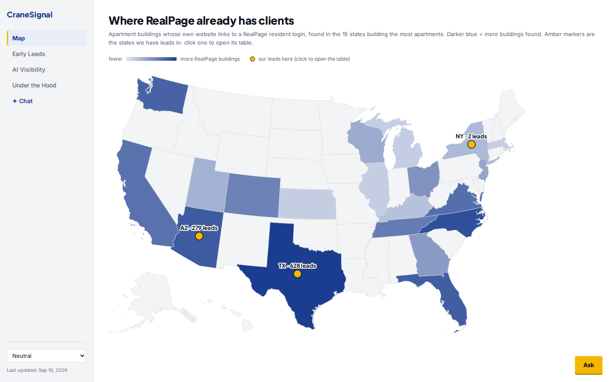
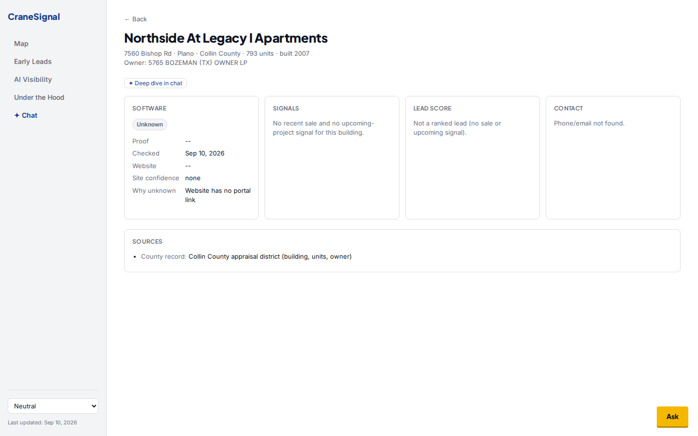

# CraneSignal

CraneSignal shows which property-management software every apartment building in an area runs,
and flags the buildings most likely to switch soon (just sold, new owner, under construction).
A built-in chat agent answers questions about the same data, with sources.

**Who it is for:** sales and marketing teams at property-management software companies
(RealPage, Yardi, Entrata, AppFolio and the like) who want early, evidence-backed leads.
It covers any US area; Plano/Richardson, Texas is the worked sample.

**The constraint: outside-in only.** We have no access to proprietary sales data — no
insiders, no product login, no customer data, nobody there to ask. Everything
here comes from public sources. **The goal:** build a finished, working MVP
from this evidence that any property-management software company would actually
use, show from outside that they don't already have it, and pitch it. Drew
makes the calls; ask him when a decision is his.

## What it looks like





More screens (Early Leads, Under the Hood, chat): `docs/design-screens/final/`.

## What runs where

| Part | Folder | What it is |
|---|---|---|
| Website service | `site/` | Static pages (Map, Early Leads, Property Detail, AI Visibility, Under the Hood) served by Caddy. Reads the JSON in `site/data/`. |
| Chat service | `chatbot/` | A Hermes agent behind a small proxy (`proxy.py`) plus the Open WebUI chat app. Answers only from the baked-in data and research, read-only. Details: `chatbot/README.md`. |
| Data | `propertystack/` | The pipeline of skills (find apartments → find website → detect software → find sales → score leads) and its outputs in `propertystack/data/<area>/`. Details: `propertystack/README.md`. |
| Tools | `tooling/` | Local run scripts, QA checks, and the helpers that turn pipeline data into what the site and chat read. |
| Research | `archive/realpage/01-company/` … `archive/realpage/09-build-ideas/`, `archive/realpage/raw/` | Public-source evidence about RealPage and its market. `raw/` is verbatim captures: add, never edit. |
| Plans | `docs/plans/` | Finished and open build plans, listed in `docs/plans/README.md`. Older material is in `archive/`. |

Both services deploy to Railway from the `main` branch. New work is tried locally first and
goes to `main` only after Drew's OK.

## Start it locally

```bash
bash tooling/dev.sh        # start, no sign-in anywhere
bash tooling/dev.sh stop   # stop everything it started
```

Site: http://localhost:8765 · chat app: http://localhost:3000.
Needs Docker, `DEEPSEEK_API_KEY` in your shell, and `JINA_API_KEY` in a gitignored `.env`.
Keys are never committed.

## Tests

```bash
python3 -m pytest -q chatbot/tests tooling/realpage-library/tests tooling/qa/fixes_tests
```

- `chatbot/tests/` — the chat proxy and answer formatting.
- `tooling/realpage-library/tests/` — the realpage.com library tools.
- `tooling/qa/fixes_tests/` — site and data checks, one per fixed issue.
- `bash tooling/qa/check-live.sh` — checks the live site and chat.

## Deliberately not built yet

- **One-step new areas.** Adding an area still means running the pipeline skills by hand.
- **Weekly refresh.** Data is a dated snapshot (the site shows "Last updated"); nothing re-runs on a schedule.
- **Shared team memory.** The chat remembers one conversation, not a team's history.
- **Pricing and billing.** The offer is free early access in exchange for feedback.

Open plans for these are in `docs/plans/`.

## Ground rules

- Collection is read-only toward third parties: no posting, voting or account actions.
  Rate-limit politely.
- Every claim links to a public source. Trust raw captures over summaries when they disagree.
- Claims without a linked source are marked `(unsourced)`.
